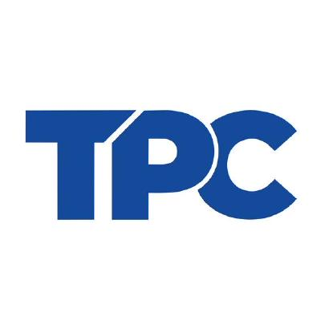
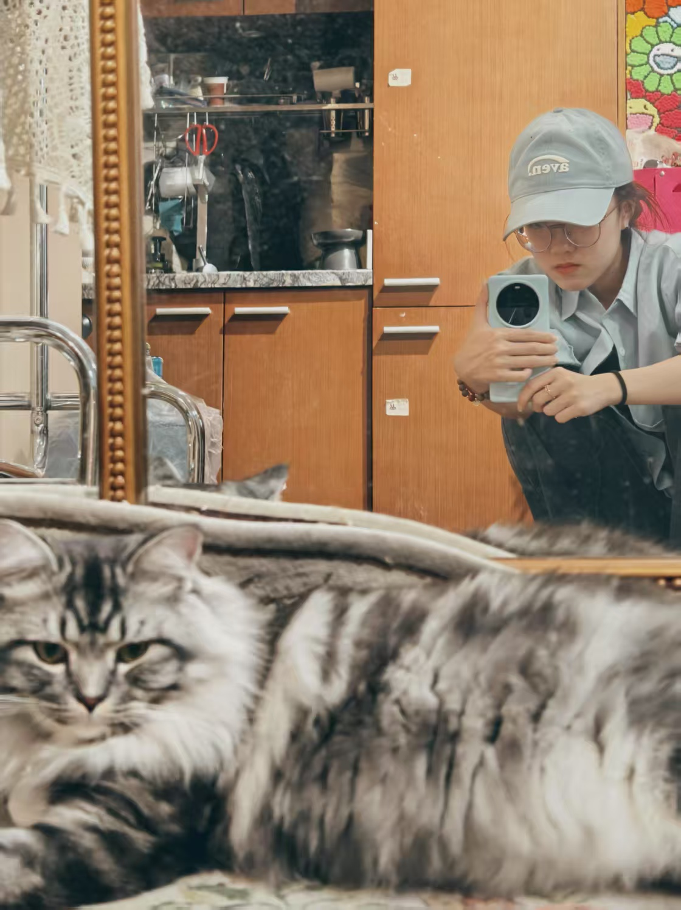
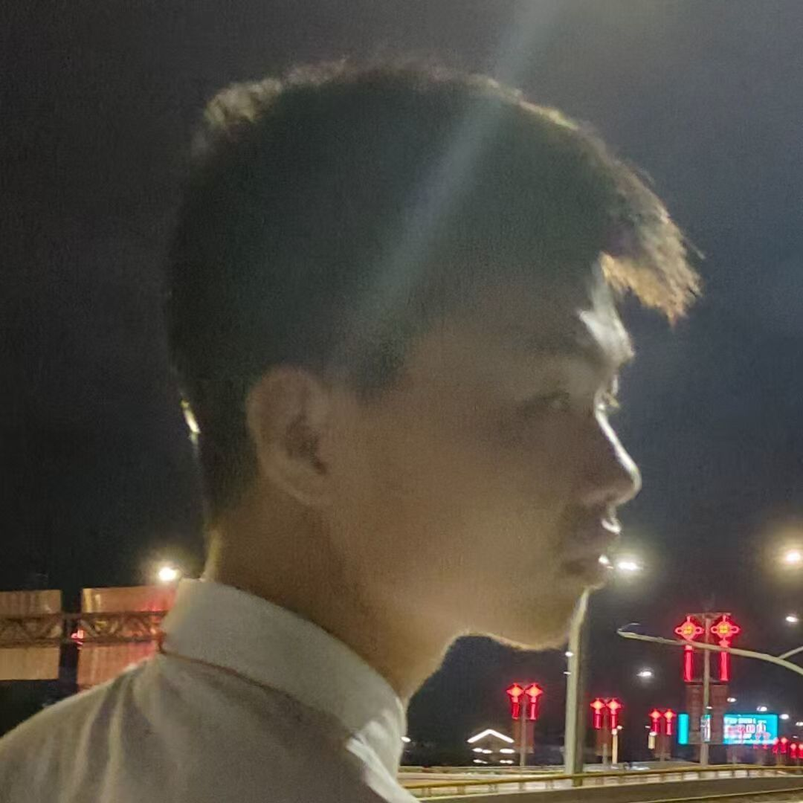
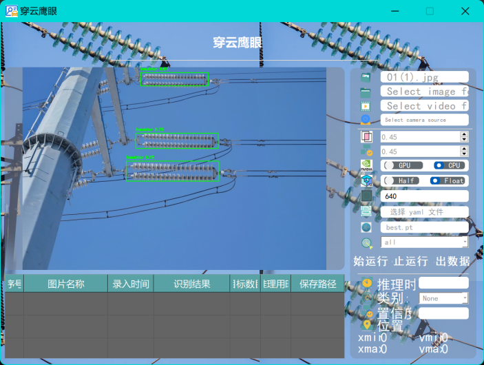
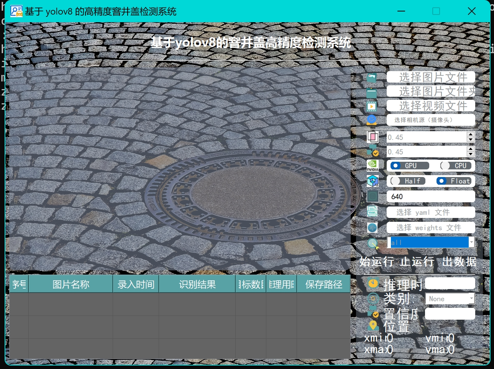
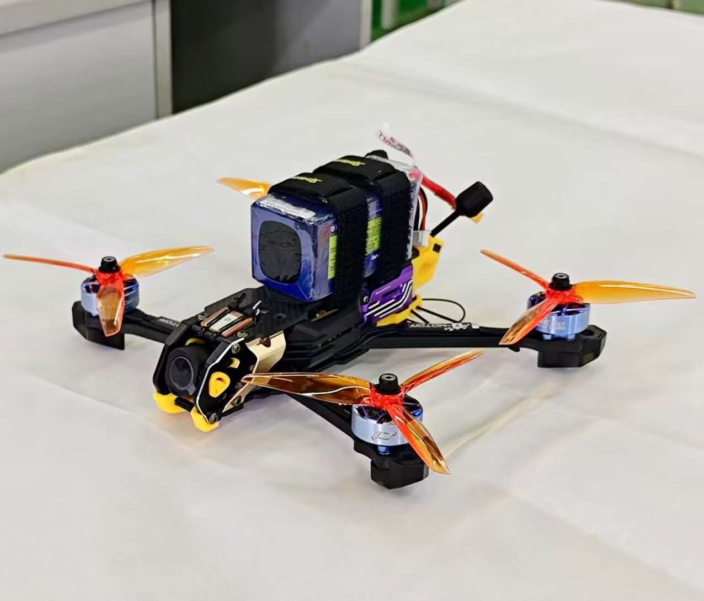
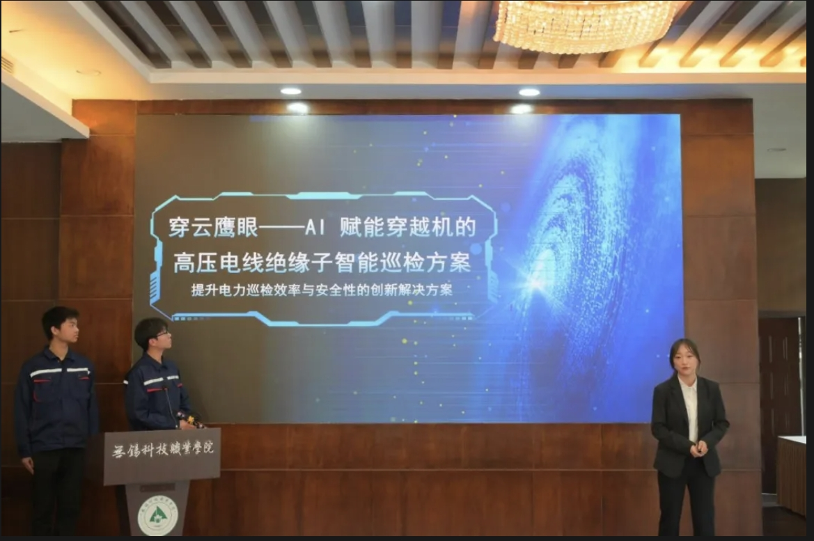
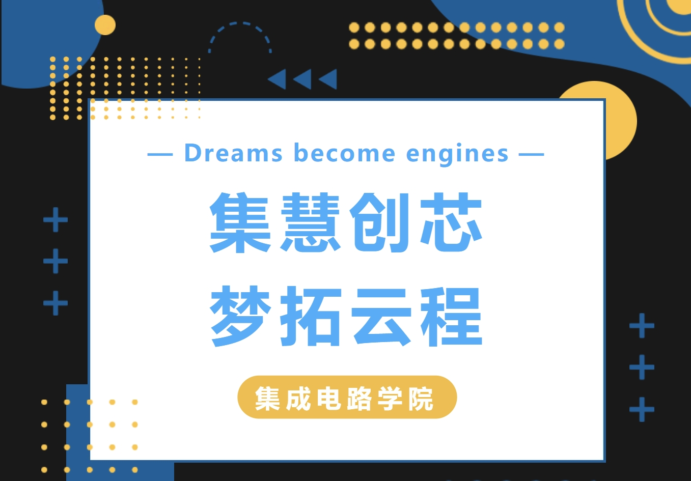

<!DOCTYPE html>
<html lang="zh-CN">
<head>
    <meta charset="UTF-8">
    <meta name="viewport" content="width=device-width, initial-scale=1.0">
    <title>时间碎片实验室</title>
    <link rel="stylesheet" href="https://cdnjs.cloudflare.com/ajax/libs/font-awesome/5.15.3/css/all.min.css">
    
</head>
<body>
    

    
    <!-- 主体内容 -->
    

        <!-- 导航栏 -->
        <header>
            

                
                

                    <h1 style="background:var(--primary-gradient);-webkit-background-clip:text;-webkit-text-fill-color:transparent;">时间碎片实验室</h1>
                    
Timepiece Laboratory

                

            

            <nav>
                <ul>
                    <li><a href="text.html">首页</a></li>
                    <li><a href="pages/YanJiuFX.html">研究方向</a></li>
                    <li><a href="pages/grjs.html">团队成员</a></li>
                    <li><a href="pages/tdcg.html">团队成果</a></li>
                    <li><a href="https://qm.qq.com/q/9V7tPQq590">联系我们</a></li>
                </ul>
            </nav>
        </header>

        <!-- 英雄区域 -->
        <section class="hero">
            <h2>探索科技的无限可能</h2>
            
时间碎片实验室由四位来自不同领域的科研爱好者组成，致力于人工智能、集成电路、物联网领域的交叉研究。我们相信，通过跨学科的合作与创新，能够推动科技进步，解决人类面临的重大挑战。

        </section>
<section class="cta-buttons">
    <a href=https://qm.qq.com/q/9V7tPQq590" class="btn-primary">加入我们</a>
    <a href="pages/Laboratory Online Tools.html" class="btn-secondary">实验室工具</a>
</section>

        <!-- 特色板块 -->
        <section class="features">
            

                

                   ⚛️
                

                <h3>集成电路</h3>
                
通过控制晶体管的开关状态来实现信号的处理和传输，从而完成各种复杂的逻辑运算和数据处理任务。

            

            

                

                    🧠
                

                <h3>人工智能</h3>
                
我们研究深度学习、强化学习和神经科学交叉领域，开发具有类人认知能力的下一代AI系统。

            

            

                

                    💻
                

                <h3>物联网</h3>
                
利用各种传感器将物体与互联网相联系，按照一定规则进行数据交互和通信，以实现智能化识别、定位、跟踪、监控和管理。

            

        </section>

        <!-- 团队成员 -->
        <section>
            <h2 style="text-align:center;margin:50px 0; background:var(--primary-gradient);-webkit-background-clip:text;-webkit-text-fill-color:transparent;">我们的团队</h2>
            

                

                    

                        
                    

                    <h3>陈一菲</h3>
                    
人工智能精英

                    
来自应电2301班，擅长各种编程语言，熟悉各种数据结构和算法。

                    

                        <a href="https://qm.qq.com/q/9V7tPQq590" style="color:#aaa;"><i class="fab fa-qq"></i></a>
                        <a href="https://qm.qq.com/q/9V7tPQq590" style="color:#aaa;"><i class="fab fa-weixin"></i></a>
                    

                

                

                    

                        
                    

                    <h3>储天溢</h3>
                    
集成电路爱好者

                    
熟悉各种数字电路和模拟电路，尤其擅长集成电路的调试与修复。

                    

                        <a href="https://qm.qq.com/q/9V7tPQq590" style="color:#aaa;"><i class="fab fa-qq"></i></a>
                        <a href="https://qm.qq.com/q/9V7tPQq590" style="color:#aaa;"><i class="fab fa-weixin"></i></a>
                    

                

                

                    

                        
                    

                    <h3>张嘉仪</h3>
                    
物联网项目爱好者

                    
擅长做各种物联网项目，并且把这些项目发布在github。

                    

                        <a href="https://qm.qq.com/q/9V7tPQq590" style="color:#aaa;"><i class="fab fa-qq"></i></a>
                        <a href="https://qm.qq.com/q/9V7tPQq590" style="color:#aaa;"><i class="fab fa-weixin"></i></a>
                    

                

                

                    

                        
                    

                    <h3>朱凯</h3>
                    
机器学习研究者

                    
喜欢钻研机器学习方面的问题尤其是深度学习，同时也会一些计算机视觉的应用

                    

                        <a href="https://qm.qq.com/q/9V7tPQq590" style="color:#aaa;"><i class="fab fa-qq"></i></a>
                        <a href="https://qm.qq.com/q/9V7tPQq590" style="color:#aaa;"><i class="fab fa-weixin"></i></a>
                    

                

            

        </section>

        <!-- 项目展示 -->
        <section>
            <h2 style="text-align:center;margin:50px 0;background:var(--primary-gradient);-webkit-background-clip:text;-webkit-text-fill-color:transparent;">近期项目</h2>
            

                

                    

                        
                    

                    

                        <h3>穿云鹰眼</h3>
                        
这是一款基于Yolov8和FPV的绝缘子检测系统，用户可以在导入图片/视频文件后实时检测绝缘子，当然也可以通过打开挂载在FPV上的摄像头实时监测

                        

                            自研系统
                            人工智能
                        

                        <a href="mp4/1.mp4" style="color:var(--secondary-color);text-decoration:none;margin-top:auto;">查看详情 →</a>
                    

                

                

                    

                        
                    

                    

                        <h3>基于yolov8的窨井盖检测系统</h3>
                        
我们团队自主开发的一套基于yolov8的窨井盖检测系统，可以检测识别各种类型的井盖，并且可以部署到机载计算机，实现无人机巡检窨井盖的功能。

                        

                            深度学习
                            人工智能
                        

                        <a href="mp4/2.mp4" style="color:var(--secondary-color);text-decoration:none;margin-top:auto;">查看详情 →</a>
                    

                

                

                    

                        
                    

                    

                        <h3>自主组装的五寸穿越机</h3>
                        
我们团队自主组装了大疆N3飞行眼镜、大疆O4 Pro天空端和五寸穿越机

                        

                            FPV
                            物联网
                        

                        <a href="mp4/3.mp4" style="color:var(--secondary-color);text-decoration:none;margin-top:auto;">查看详情 →</a>
                    

                

            

        </section>
    

<!--团队活动-->
 <section>
            <h2 style="text-align:center;margin:50px 0;background:var(--primary-gradient);-webkit-background-clip:text;-webkit-text-fill-color:transparent;">团队活动</h2>
            

                

                    

                        
                    

                    

                        <h3>挑战杯校赛</h3>
                        
本次竞赛中，时间碎片的团队成员们参与的是 “人工智能 +” 专项赛赛道，带来的项目 “穿云鹰眼: AI 赋能穿越机的高压电线绝缘子智能巡检方案”极具创新性与实用性。

                        

                            挑战杯
                            人工智能+赛道
                        

                        <a href="https://mp.weixin.qq.com/s/1QG9iAfkISlKnmEK2M2gWA" >查看详情 →</a>
                    

                

                

                    

                        
                    

                    

                        <h3>大学生人工智能创新应用选拔赛</h3>
                        
为激发AI创新热情，培育未来科技火种，助力产学研融合，托举智能时代新星。时间碎片社联合集慧创芯社举办了大学生人工智能创新应用选拔赛。众多参赛选手围绕人工智能在多个领域的应用展开激烈角逐，充分展现了当代学子的卓越风采！

                        

                            人工智能赛
                            社团活动
                        

                        <a href="https://mp.weixin.qq.com/s/2OCB77jkeABCpUo4ju9ILA" >查看详情 →</a>
                    

                

            

        </section>

    <!-- 音乐播放器 -->
    

        
加载中...

        

            <audio id="audio" preload="metadata"></audio>
            

                <button class="music-btn" id="prev-btn" title="上一首">⏮️</button>
                <button class="music-btn" id="play-pause-btn" title="播放/暂停">▶️</button>
                <button class="music-btn" id="next-btn" title="下一首">⏭️</button>
            

        

    

    <!-- 粒子脚本 -->
    

    <!-- 动画和播放器脚本优化 -->
    

    <!-- 加载粒子库 -->
    
</body>
</html>
